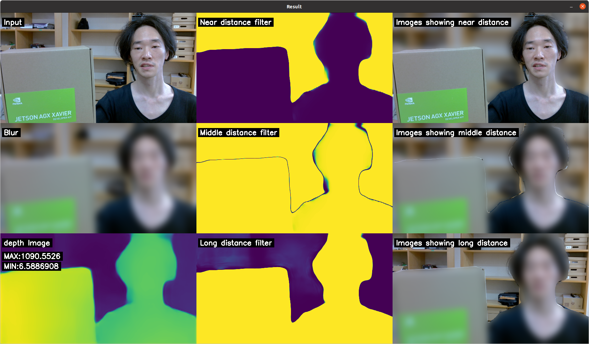

# Description
コミュニケションツールのフィルター処理を深度推定モデルを用いて改善する。  
Improve the filtering process of the Communicate tool using a depth estimation model.

# Background
ビデオ会議の背景モザイクは、人の物体検出によるものが主流です。  
Most videoconferencing background mosaics are based on human object detection.

しかし物体検出では、画面に映りこむ人はみな表示されてしまいますし、人以外の物は表示されません。  
With object detection, however, all people on the screen are displayed, and non-human objects are not.

そこで、単眼カメラ深度推定モデルを用い、深度によるモザイク処理を行うことを提案します 。  
Therefore, we propose to use a monocular camera depth estimation model to perform mosaicing by depth.

# Hardware requirements
JetsonとJetsonが認識可能なカメラモジュール ,インターネットへ接続できる環境が必要です。  
Jetson and a Jetson-recognizable camera module , Internet access is required.

私たちは、次の実行環境を用意し検証しました。  
I tested in the following environment
* Jetson 
	Jetson AGX Xavier Developer Kit
* Webcam
	Logicool C270 HD Webcam


# Software requirements
■ Deep Learning Framework
深度推定モデルは「MiDaS」を使用します。  
The depth estimation model uses "MiDaS".

「[MiDaS](https://pytorch.org/hub/intelisl_midas_v2/)」の実行にはPytorchが必要となります。  
Pytorch is required to run ["MiDaS"](https://pytorch.org/hub/intelisl_midas_v2/).

Pytorchのインストールは、Nvidiaが用意しているマニュアルを参照してください。  
Please refer to the manual provided by Nvidia for installing Pytorch.

[Installing PyTorch for Jetson Platform :: NVIDIA Deep Learning Frameworks   Documentation](https://docs.nvidia.com/deeplearning/frameworks/install-pytorch-jetson-platform/index.html)

■ WebCamera Settings
WebCameraの設定は、各製品毎の設定に従ってください。  
Follow the settings for each product for WebCamera.

■ And More
必要なPythonモジュールをインストールします。  
Install the required Python modules.

```
$ cd {source directory}
$ python3 -m pip install --upgrade pip;
$ python3 -m pip install -r requirements.txt;
```

## Install

```
$ git clone {git repository URL}
```

## Run program

```
$ cd {git directory}/src
$ python3 main.py
```

# Demonstration
プログラムを実行すると、以下のような画面が表示されます。  
When you run the program, you will see a screen like the one below.



スクリーンショットの画像は以下を表しています。
| 　 | 　 | 　 |
| :--- | :--- | :--- |
| [カメラ画像] | [近距離判定結果] | [近距離画像] |
| [フィルター画像] | [中距離判定結果] | [中距離画像] |
| [深度画像] | [遠距離判定結果] | [遠距離画像] |


# Licence
See LICENSE file

